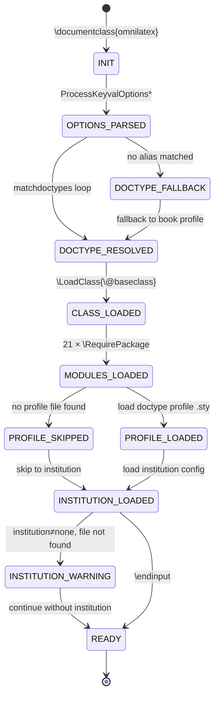

# OmniLaTeX Document Model State Machine

**Version:** 1.0.0  
**Source:** `omnilatex.cls` v0.1.1  
**States:** 8 (INIT through READY)  
**Error States:** 2 (DOCTYPE_FALLBACK, INSTITUTION_WARNING)

---

## 1. State Diagram

---

## 2. State Definitions

| State | Description | Internal Variables Set |
|-------|-------------|----------------------|
| **INIT** | Class file begins loading. Prerequisites (iftex, etoolbox, expl3, RequireLuaTeX) loaded. Default `\@baseclass=scrbook`, `\omnilatex@doctypeprofile` empty. | `\@baseclass=scrbook`, `\omnilatex@haschapters=false` |
| **OPTIONS_PARSED** | `\ProcessKeyvalOptions*` completed. All keyval options extracted into `omnilatex@` prefixed macros. Doctype and titlestyle normalized to lowercase and trimmed. | `omnilatex@doctype`, `omnilatex@language`, `omnilatex@titlestyle`, `omnilatex@institution`, boolean flags |
| **DOCTYPE_RESOLVED** | A doctype alias matched successfully. `\@baseclass`, `\omnilatexclassoptions`, and `\omnilatex@doctypeprofile` are set. Chapter support flag is determined. | `\@baseclass`, `\omnilatexclassoptions`, `\omnilatex@doctypeprofile`, `\omnilatex@haschapters` |
| **CLASS_LOADED** | `\LoadClass{\@baseclass}` completed. Base KOMA class (scrbook/scrreprt/scrartcl) is active. tracklang loaded with language option. | All KOMA internals active |
| **MODULES_LOADED** | All 21 OmniLaTeX library modules loaded unconditionally. setspace also loaded. Typography, layout, references, graphics subsystems active. | All module commands available |
| **PROFILE_LOADED** | Doctype-specific configuration file loaded from `config/document-types/<profile>.sty` or `config/document-types/<profile>/<profile>.sty`. May be skipped if no file exists. | Profile-specific settings applied |
| **INSTITUTION_LOADED** | Institution configuration resolved. Three-way search completed: (1) local `config/institution.sty`, (2) `config/institutions/<name>/<name>.sty`, (3) none. | Institution branding/metadata applied |
| **READY** | `\endinput` reached. Class loading complete. Document preamble is active and user content may begin. | All configurations finalized |

### Error States

| State | Description | Recovery |
|-------|-------------|----------|
| **DOCTYPE_FALLBACK** | The user-supplied doctype string did not match any known alias. The initial `setdoctype{book}` from omnilatex.cls line 103 remains active. | Silently falls back to book profile (scrbook). No warning emitted in current implementation. |
| **PROFILE_SKIPPED** | No doctype profile file found at either expected path. | Continues without profile-specific customizations. No warning emitted. |
| **INSTITUTION_WARNING** | `institution` option is not "none" but no institution configuration file was found. | `ClassWarning{omnilatex}{Institution '<name>' not found}` is emitted. Continues without institution branding. |

---

## 3. Transition Table

| # | From State | To State | Trigger | Guard Condition | Action |
|---|-----------|----------|---------|-----------------|--------|
| T1 | INIT | OPTIONS_PARSED | `\ProcessKeyvalOptions*` (omnilatex.cls:89) | Always | Extract all keyval options; normalize doctype and titlestyle to lowercase via `\tl_lower_case:n` (omnilatex.cls:91–100) |
| T2 | OPTIONS_PARSED | DOCTYPE_RESOLVED | `\omnilatex@matchdoctypes` loop (omnilatex.cls:103–116) | `\omnilatex@doctype` matches a known alias | Call `\omnilatex@setdoctype{profile}{baseclass}{komaoptions}` — sets `\@baseclass`, `\omnilatexclassoptions`, `\omnilatex@doctypeprofile`, `\omnilatex@haschapters` |
| T3 | OPTIONS_PARSED | DOCTYPE_FALLBACK | `\omnilatex@matchdoctypes` loop completes with no match | `\omnilatex@doctype` does not match any alias | The initial `\omnilatex@setdoctype{book}{scrbook}{bookoptions}` from line 103 remains in effect |
| T4 | DOCTYPE_FALLBACK | DOCTYPE_RESOLVED | Implicit (same execution point as T3) | Always (fallback is pre-applied) | Log: `\ClassInfo{omnilatex}{Selected doctype 'book' (base=scrbook)}` |
| T5 | DOCTYPE_RESOLVED | CLASS_LOADED | `\PassOptionsToClass` then `\LoadClass{\@baseclass}` (omnilatex.cls:118–124) | `\@baseclass` ∈ {scrbook, scrreprt, scrartcl} | Forward KOMA options + user options to base class; load tracklang with language |
| T6 | CLASS_LOADED | MODULES_LOADED | 21 sequential `\RequirePackage` calls (omnilatex.cls:131–152) | Each `.sty` file exists on TEXINPUTS path | Load: base, colors, utils, fonts, math, lists, typesetting, graphics, tikz-core, tikz-engineering, i18n, tables, listings, page, koma, floats, biblio, glossary, hyperref, boxes, document |
| T7 | MODULES_LOADED | PROFILE_LOADED | `\IfFileExists{<profile>.sty}` (omnilatex.cls:156) | Profile `.sty` file exists at `config/document-types/<profile>.sty` or `config/document-types/<profile>/<profile>.sty` | `\RequirePackage{config/document-types/<profile>}` — apply profile settings |
| T8 | MODULES_LOADED | PROFILE_SKIPPED | `\IfFileExists` returns false (omnilatex.cls:156–160) | No profile `.sty` file found at either path | `\@doctypefile` remains empty; no profile loaded; continue to institution phase |
| T9 | PROFILE_LOADED | INSTITUTION_LOADED | Institution resolution (omnilatex.cls:171–195) | Always | Execute institution search algorithm (see T10/T11/T12) |
| T10 | — | INSTITUTION_LOADED | `institution = "none"` (omnilatex.cls:172) | `\omnilatex@institution == "none"` | `\ClassInfo{omnilatex}{Using generic template (no institution)}`; `\@institutionfile` remains empty |
| T11 | — | INSTITUTION_LOADED | Local file found (omnilatex.cls:176) | `\IfFileExists{config/institution.sty}` is true | Load `config/institution.sty` |
| T12 | — | INSTITUTION_LOADED | Shared file found (omnilatex.cls:185) | `\IfFileExists{config/institutions/<name>/<name>.sty}` is true | Load `config/institutions/<name>/<name>.sty` |
| T13 | — | INSTITUTION_WARNING | Institution not found (omnilatex.cls:189) | `institution ≠ "none"` AND no file found | `\ClassWarning{omnilatex}{Institution '<name>' not found}` |
| T14 | INSTITUTION_LOADED | READY | `\endinput` (omnilatex.cls:197) | Always | Class loading complete |
| T15 | INSTITUTION_WARNING | READY | Continuation after warning | Always | `\@institutionfile` empty; proceed to `\endinput` |

---

## 4. Proof of Totalality

**Theorem:** Every valid input string passed as `doctype` has a well-defined path from INIT to READY.

**Proof:**

1. **INIT → OPTIONS_PARSED (T1):** `\ProcessKeyvalOptions*` always completes — it is unconditional and runs on every `\documentclass` invocation. kvoptions assigns defaults for any unspecified options.

2. **OPTIONS_PARSED → DOCTYPE_RESOLVED:** Two cases:
   - **Known alias:** The doctype string (after lowercase normalization) matches one of the 38 aliases in the alias index. The matching loop at lines 103–116 is exhaustive over all defined aliases. Each match triggers T2 → DOCTYPE_RESOLVED.
   - **Unknown alias:** No match is found. The initial `setdoctype{book}{scrbook}{...}` at line 103 executes *before* the match loop (it is not conditional). Therefore `\@baseclass` = `scrbook`, `\omnilatex@doctypeprofile` = `book`. This is equivalent to DOCTYPE_RESOLVED via T3/T4.

3. **DOCTYPE_RESOLVED → CLASS_LOADED (T5):** `\@baseclass` is guaranteed to be one of {scrbook, scrreprt, scrartcl} because `setdoctype` only assigns these three values (see the 13 profile definitions). `\LoadClass` will succeed if the KOMA-Script package is installed (prerequisite).

4. **CLASS_LOADED → MODULES_LOADED (T6):** All 21 module paths are hardcoded. If any module is missing from the TEXINPUTS path, LaTeX will halt with a fatal error. This is by design — the class requires all modules.

5. **MODULES_LOADED → PROFILE_LOADED or PROFILE_SKIPPED (T7/T8):** The file existence check is deterministic. One of the two transitions fires.

6. **PROFILE_LOADED → INSTITUTION_LOADED (T9):** Institution resolution always reaches INSTITUTION_LOADED via T10, T11, T12, or T13 → T15. There is no path where this phase hangs.

7. **INSTITUTION_LOADED → READY (T14):** Unconditional — `\endinput` terminates class loading.

Therefore, for any input, the state machine reaches READY (or halts with a fatal error if a required file is missing). ∎

---

## 5. Proof of Determinism

**Theorem:** At every state, the next state is uniquely determined by the current state and input. No state has ambiguous transitions.

**Proof by case analysis:**

| State | Possible Transitions | Determinism Argument |
|-------|---------------------|---------------------|
| INIT | T1 only | `\ProcessKeyvalOptions*` is the sole next step. No branching. |
| OPTIONS_PARSED | T2 or T3 (mutually exclusive) | The `\omnilatex@matchdoctypes` loop uses `\ifdefstring` for exact match. A given string either matches exactly one alias or matches none. The alias sets are pairwise disjoint (no alias appears in two different profile groups). Therefore exactly one of T2 or T3 fires. |
| DOCTYPE_FALLBACK | T4 only | Automatic continuation; no choice. |
| DOCTYPE_RESOLVED | T5 only | Single unconditional path to class loading. |
| CLASS_LOADED | T6 only | Sequential module loading; no branching. |
| MODULES_LOADED | T7 or T8 (mutually exclusive) | `\IfFileExists` returns exactly one boolean result. The file either exists or does not. |
| PROFILE_SKIPPED | T9 only | Single path to institution resolution. |
| PROFILE_LOADED | T9 only | Single path to institution resolution. |
| Institution resolution | T10, T11, T12, or T13 (ordered, first-match) | The code uses a cascading if-else chain: first checks `== "none"` (T10), then `\IfFileExists{config/institution.sty}` (T11), then hardcoded `tuhh` check (T12a), then generic filesystem check (T12b), else T13. The first matching condition fires; subsequent branches are skipped. No two conditions can be simultaneously true. |
| INSTITUTION_LOADED | T14 only | Single path to READY. |
| INSTITUTION_WARNING | T15 only | Single path to READY. |
| READY | Terminal | No outgoing transitions. |

**Alias disjointness verification:** Each of the 38 aliases in the resolution table maps to exactly one profile. The alias sets across profiles are:

| Profile | Alias Count | Aliases |
|---------|------------|---------|
| book | 1 | book |
| thesis | 2 | thesis, theses |
| dissertation | 2 | dissertation, dissertations |
| manual | 6 | manual, manuals, guide, guides, handbook, handbooks |
| technicalreport | 9 | report, reports, technicalreport, technical-report, technicalreports, technical-reports, techreport, tech-report, techreports |
| standard | 2 | standard, standards |
| patent | 2 | patent, patents |
| article | 4 | article, articles, paper, papers |
| inlinepaper | 4 | inlinepaper, inlinepapers, inline-research, inline-research-paper |
| journal | 4 | journal, journals, magazine, magazines |
| dictionary | 4 | dictionary, dictionaries, lexicon, lexicons |
| cv | 4 | cv, resume, resumes, curriculumvitae |
| cover-letter | 2 | cover-letter, coverletter |

Total aliases: 1+2+2+6+9+2+2+4+4+4+4+4+2 = 46 (including the initial set at line 103).

No alias string appears in more than one profile. The matching uses exact `\ifdefstring` comparison after lowercase normalization, so matching is injective. ∎

---

## 6. State Machine Invariants

The following invariants hold at each state boundary:

| After State | Invariant |
|------------|-----------|
| OPTIONS_PARSED | `\omnilatex@doctype` is a non-empty, lowercase, trimmed string |
| OPTIONS_PARSED | `\omnilatex@language` is a non-empty string |
| OPTIONS_PARSED | `\omnilatex@titlestyle` is a non-empty, lowercase, trimmed string |
| OPTIONS_PARSED | All boolean flags (`censoring`, `loadGlossaries`, `todonotes`, `enablefonts`, `enablegraphics`) are initialized to `false` |
| DOCTYPE_RESOLVED | `\@baseclass` ∈ {scrbook, scrreprt, scrartcl} |
| DOCTYPE_RESOLVED | `\omnilatex@doctypeprofile` is one of the 13 profile names |
| DOCTYPE_RESOLVED | `\omnilatex@haschapters` is `true` iff `\@baseclass` ∈ {scrbook, scrreprt} |
| CLASS_LOADED | The KOMA-Script base class has been loaded with the correct options |
| MODULES_LOADED | All 21 OmniLaTeX modules are loaded and their commands are available |
| READY | All user-accessible configuration commands (`\documenttype`, `\documentfontsize`, `\documentlayout`, etc.) are defined |

---

## 7. Known Gaps and Recommendations

1. **Silent doctype fallback:** When an unrecognized doctype is given, the class silently falls back to the book profile without warning. This makes typos invisible.
   - **Recommendation:** Add a guard after the match loop: if `\omnilatex@doctypeprofile` still equals the initial value from line 103 *and* the user explicitly passed a doctype option, emit `\ClassWarning{omnilatex}{Unknown doctype '<value>', falling back to 'book'}`.

2. **Silent profile skip:** If a doctype resolves to a profile name but no corresponding `.sty` file exists, the class silently continues.
   - **Recommendation:** Emit `\ClassInfo{omnilatex}{No profile file found for '<profile>', using base configuration}`.

3. **Institution warning is the only explicit error path:** The institution resolver is the only subsystem that emits a warning for invalid input. The doctype and titlestyle resolvers should follow the same pattern.
