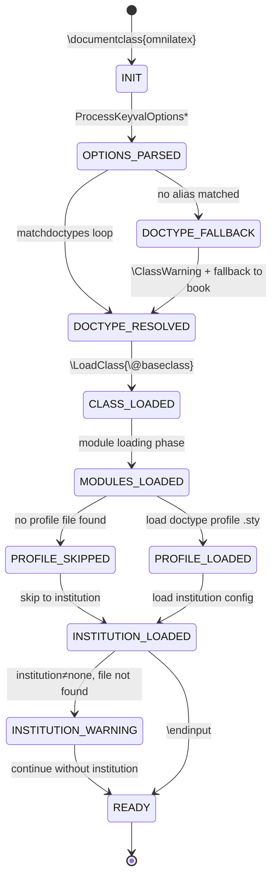

# OmniLaTeX Document Model State Machine

**Version:** 1.1.0
**Source:** `omnilatex.cls` v1.25.0
**Profiles:** 26 canonical doctypes
**Aliases:** 81 unique alias strings
**Modules:** 28 library modules (14 unconditional + 2 language-conditional + 7 toggle-conditional + 5 on-demand)
**Institutions:** 16
**Class Options:** 14 (4 string + 10 bool)
**States:** 8 (INIT through READY)
**Error States:** 2 (DOCTYPE_FALLBACK, INSTITUTION_WARNING)

---

## 1. State Diagram

---

## 2. State Definitions

| State | Description | Internal Variables Set |
|-------|-------------|----------------------|
| **INIT** | Class file begins loading. Prerequisites (iftex, etoolbox, expl3, RequireLuaTeX) loaded. Default `\@baseclass=scrbook`, `\omnilatex@doctypeprofile` empty. `\omnilatex@doctypematched` flag initialized to false. | `\@baseclass=scrbook`, `\omnilatex@haschapters=false`, `\omnilatex@doctypematched=false` |
| **OPTIONS_PARSED** | `\ProcessKeyvalOptions*` completed. All keyval options extracted into `omnilatex@` prefixed macros. Doctype and titlestyle normalized to lowercase and trimmed via expl3 `\tl_lower_case:n` and `\tl_trim_spaces:N`. | `omnilatex@doctype`, `omnilatex@language`, `omnilatex@titlestyle`, `omnilatex@institution`, 10 boolean flags |
| **DOCTYPE_RESOLVED** | A doctype alias matched successfully (or fallback applied). `\@baseclass`, `\omnilatexclassoptions`, and `\omnilatex@doctypeprofile` are set. Chapter support flag is determined. `\omnilatex@doctypematched` is true. | `\@baseclass`, `\omnilatexclassoptions`, `\omnilatex@doctypeprofile`, `\omnilatex@haschapters`, `\omnilatex@doctypematched=true` |
| **CLASS_LOADED** | `\LoadClass{\@baseclass}` completed. Base KOMA class (scrbook/scrreprt/scrartcl) is active. tracklang loaded with language option. | All KOMA internals active |
| **MODULES_LOADED** | 14 unconditional modules loaded, followed by language-conditional modules (CJK, RTL) and toggle-conditional modules. Typography, layout, references, graphics subsystems active (subject to toggle flags). | All loaded module commands available |
| **PROFILE_LOADED** | Doctype-specific configuration file loaded from `config/document-types/<profile>.sty` or `config/document-types/<profile>/<profile>.sty`. | Profile-specific settings applied |
| **INSTITUTION_LOADED** | Institution configuration resolved. Three-way search completed: (1) local `config/institution.sty`, (2) hardcoded `tuhh` check, (3) generic `config/institutions/<name>/<name>.sty`, (4) none. | Institution branding/metadata applied |
| **READY** | `\endinput` reached. Class loading complete. Document preamble is active and user content may begin. | All configurations finalized |

### Error States

| State | Description | Recovery |
|-------|-------------|----------|
| **DOCTYPE_FALLBACK** | The user-supplied doctype string did not match any of the 81 known aliases. The initial `\omnilatex@setdoctype{book}{scrbook}{...}` from line 111 remains active. `\omnilatex@doctypematched` remains false. | `\ClassWarning{omnilatex}{Unknown doctype '<value>'. Falling back to 'book'.}` is emitted (omnilatex.cls:140--147). The warning lists all 26 valid canonical names. Falls back to book profile (scrbook). |
| **PROFILE_SKIPPED** | No doctype profile file found at either expected path. | Continues without profile-specific customizations. No warning emitted. |
| **INSTITUTION_WARNING** | `institution` option is not "none" but no institution configuration file was found. | `ClassWarning{omnilatex}{Institution '<name>' not found}` is emitted. Continues without institution branding. |

---

## 3. Transition Table

| # | From State | To State | Trigger | Guard Condition | Action |
|---|-----------|----------|---------|-----------------|--------|
| T1 | INIT | OPTIONS_PARSED | `\ProcessKeyvalOptions*` (omnilatex.cls:97) | Always | Extract all keyval options; normalize doctype and titlestyle to lowercase via `\tl_lower_case:n` (omnilatex.cls:99--108) |
| T2 | OPTIONS_PARSED | DOCTYPE_RESOLVED | `\omnilatex@matchdoctypes` loop (omnilatex.cls:111--137) | `\omnilatex@doctype` matches a known alias | Call `\omnilatex@setdoctype{profile}{baseclass}{komaoptions}` -- sets `\@baseclass`, `\omnilatexclassoptions`, `\omnilatex@doctypeprofile`, `\omnilatex@haschapters`, `\omnilatex@doctypematched=true` |
| T3 | OPTIONS_PARSED | DOCTYPE_FALLBACK | `\omnilatex@matchdoctypes` loop completes with no match | `\omnilatex@doctype` does not match any of the 81 aliases; `\omnilatex@doctypematched` is false | The initial `\omnilatex@setdoctype{book}{scrbook}{...}` from line 111 remains in effect |
| T4 | DOCTYPE_FALLBACK | DOCTYPE_RESOLVED | `\ifomnilatex@doctypematched\else` block (omnilatex.cls:140--147) | `\omnilatex@doctypematched` is false | Emit `\ClassWarning{omnilatex}{Unknown doctype ...}` with list of all 26 canonical names |
| T5 | DOCTYPE_RESOLVED | CLASS_LOADED | `\PassOptionsToClass` then `\LoadClass{\@baseclass}` (omnilatex.cls:166--172) | `\@baseclass` in {scrbook, scrreprt, scrartcl} | Forward KOMA options + user options to base class; load tracklang with language |
| T6 | CLASS_LOADED | MODULES_LOADED | Module loading phase (omnilatex.cls:180--345) | Each `.sty` file exists on TEXINPUTS path | Load 14 unconditional modules, then language-conditional (CJK/RTL), then 7 toggle-conditional modules (see Section 7) |
| T7 | MODULES_LOADED | PROFILE_LOADED | `\IfFileExists{<profile>.sty}` (omnilatex.cls:348--354) | Profile `.sty` file exists at `config/document-types/<profile>.sty` or `config/document-types/<profile>/<profile>.sty` | `\RequirePackage{config/document-types/<profile>}` |
| T8 | MODULES_LOADED | PROFILE_SKIPPED | `\IfFileExists` returns false (omnilatex.cls:348--354) | No profile `.sty` file found at either path | `\@doctypefile` remains empty; no profile loaded |
| T9 | PROFILE_LOADED | INSTITUTION_LOADED | Institution resolution (omnilatex.cls:364--386) | Always | Execute institution search algorithm (see T10--T13) |
| T10 | -- | INSTITUTION_LOADED | `institution = "none"` (omnilatex.cls:365) | `\omnilatex@institution == "none"` | `\ClassInfo{omnilatex}{Using generic template (no institution)}` |
| T11 | -- | INSTITUTION_LOADED | Local file found (omnilatex.cls:369) | `\IfFileExists{config/institution.sty}` is true | Load `config/institution.sty` |
| T12 | -- | INSTITUTION_LOADED | Shared file found (omnilatex.cls:374--381) | Hardcoded `tuhh` check OR `\IfFileExists{config/institutions/<name>/<name>.sty}` is true | Load institution config |
| T13 | -- | INSTITUTION_WARNING | Institution not found (omnilatex.cls:382) | `institution != "none"` AND no file found | `\ClassWarning{omnilatex}{Institution '<name>' not found}` |
| T14 | INSTITUTION_LOADED | READY | `\endinput` (omnilatex.cls:390) | Always | Class loading complete |
| T15 | INSTITUTION_WARNING | READY | Continuation after warning | Always | `\@institutionfile` empty; proceed to `\endinput` |

---

## 4. Alias Disjointness Table

All 81 alias strings grouped by canonical doctype. Each alias maps to exactly one profile via `\omnilatex@matchdoctypes` using `\ifdefstring` exact comparison.

| Profile | Base Class | KOMA Options | Alias Count | Aliases |
|---------|-----------|--------------|-------------|---------|
| book | scrbook | bookoptions | 1 | book |
| thesis | scrbook | bookoptions | 2 | thesis, theses |
| dissertation | scrbook | bookoptions | 2 | dissertation, dissertations |
| manual | scrreprt | reportoptions | 6 | manual, manuals, guide, guides, handbook, handbooks |
| technicalreport | scrreprt | reportoptions | 9 | report, reports, technicalreport, technical-report, technicalreports, technical-reports, techreport, tech-report, techreports |
| standard | scrreprt | reportoptions | 2 | standard, standards |
| patent | scrreprt | reportoptions | 2 | patent, patents |
| article | scrartcl | articleoptions | 4 | article, articles, paper, papers |
| inlinepaper | scrartcl | inlinepaperoptions | 4 | inlinepaper, inlinepapers, inline-research, inline-research-paper |
| journal | scrartcl | journaloptions | 4 | journal, journals, magazine, magazines |
| dictionary | scrbook | bookoptions | 4 | dictionary, dictionaries, lexicon, lexicons |
| cv | scrartcl | cvoptions | 4 | cv, resume, resumes, curriculumvitae |
| cover-letter | scrartcl | articleoptions | 2 | cover-letter, coverletter |
| poster | scrartcl | articleoptions | 2 | poster, posters |
| presentation | scrartcl | articleoptions | 5 | presentation, presentations, slides, talk, talks |
| letter | scrartcl | articleoptions | 2 | letter, letters |
| homework | scrartcl | articleoptions | 2 | homework, homeworks |
| exam | scrartcl | articleoptions | 4 | exam, exams, examination, examinations |
| research-proposal | scrreprt | reportoptions | 3 | research-proposal, researchproposal, research-proposals |
| lecture-notes | scrartcl | articleoptions | 3 | lecture-notes, lecturenotes, lecture-note |
| syllabus | scrartcl | articleoptions | 2 | syllabus, syllabi |
| handout | scrartcl | articleoptions | 2 | handout, handouts |
| memo | scrartcl | articleoptions | 4 | memo, memos, memorandum, memorandums |
| white-paper | scrartcl | articleoptions | 2 | white-paper, whitepapers |
| invoice | scrartcl | articleoptions | 2 | invoice, invoices |
| recipe | scrartcl | articleoptions | 2 | recipe, recipes |

**Total aliases:** 1+2+2+6+9+2+2+4+4+4+4+4+2+2+5+2+2+4+3+3+2+2+4+2+2+2 = 81

**Base class distribution:** scrbook=4, scrreprt=5, scrartcl=17

No alias string appears in more than one profile. The matching uses exact `\ifdefstring` comparison after lowercase normalization, so matching is injective.

---

## 5. Proof of Totality

**Theorem:** Every valid input string passed as `doctype` has a well-defined path from INIT to READY.

**Proof:**

1. **INIT to OPTIONS_PARSED (T1):** `\ProcessKeyvalOptions*` always completes -- it is unconditional and runs on every `\documentclass` invocation. kvoptions assigns defaults for any unspecified options (doctype defaults to `thesis`, titlestyle to `book`, institution to `none`, language to `english`).

2. **OPTIONS_PARSED to DOCTYPE_RESOLVED:** Two cases:
   - **Known alias:** The doctype string (after lowercase normalization) matches one of the 81 aliases in the alias index. The matching loop at lines 112--137 is exhaustive over all defined aliases. Each match triggers T2 to DOCTYPE_RESOLVED and sets `\omnilatex@doctypematched` to true.
   - **Unknown alias:** No match is found. The initial `\omnilatex@setdoctype{book}{scrbook}{...}` at line 111 executes before the match loop (it is unconditional). Therefore `\@baseclass` = `scrbook`, `\omnilatex@doctypeprofile` = `book`. The `\omnilatex@doctypematched` flag remains false. This triggers T3 (DOCTYPE_FALLBACK) then T4 emits a `\ClassWarning` and transitions to DOCTYPE_RESOLVED.

3. **DOCTYPE_RESOLVED to CLASS_LOADED (T5):** `\@baseclass` is guaranteed to be one of {scrbook, scrreprt, scrartcl} because `\omnilatex@setdoctype` only assigns these three values (verified across all 26 profile definitions). `\LoadClass` will succeed if the KOMA-Script package is installed (prerequisite).

4. **CLASS_LOADED to MODULES_LOADED (T6):** 14 unconditional module paths are hardcoded. If any module is missing from the TEXINPUTS path, LaTeX will halt with a fatal error. Language-conditional and toggle-conditional modules load based on runtime flags; missing conditional modules also halt. This is by design.

5. **MODULES_LOADED to PROFILE_LOADED or PROFILE_SKIPPED (T7/T8):** The file existence check is deterministic. One of the two transitions fires.

6. **PROFILE_LOADED/PROFILE_SKIPPED to INSTITUTION_LOADED (T9):** Institution resolution always reaches INSTITUTION_LOADED via T10, T11, T12, or T13 then T15. There is no path where this phase hangs.

7. **INSTITUTION_LOADED to READY (T14):** Unconditional -- `\endinput` terminates class loading.

Therefore, for any input, the state machine reaches READY (or halts with a fatal error if a required file is missing). Unknown doctypes produce a warning but still reach READY via the book fallback. QED.

---

## 6. Proof of Determinism

**Theorem:** At every state, the next state is uniquely determined by the current state and input. No state has ambiguous transitions.

**Proof by case analysis:**

| State | Possible Transitions | Determinism Argument |
|-------|---------------------|---------------------|
| INIT | T1 only | `\ProcessKeyvalOptions*` is the sole next step. No branching. |
| OPTIONS_PARSED | T2 or T3 (mutually exclusive) | The `\omnilatex@matchdoctypes` loop uses `\ifdefstring` for exact match. A given string either matches exactly one alias or matches none. The alias sets are pairwise disjoint (no alias appears in two different profile groups -- verified in Section 4). Therefore exactly one of T2 or T3 fires. |
| DOCTYPE_FALLBACK | T4 only | Automatic continuation; no choice. |
| DOCTYPE_RESOLVED | T5 only | Single unconditional path to class loading. |
| CLASS_LOADED | T6 only | Sequential module loading; no branching. |
| MODULES_LOADED | T7 or T8 (mutually exclusive) | `\IfFileExists` returns exactly one boolean result. The file either exists or does not. |
| PROFILE_SKIPPED | T9 only | Single path to institution resolution. |
| PROFILE_LOADED | T9 only | Single path to institution resolution. |
| Institution resolution | T10, T11, T12, or T13 (ordered, first-match) | The code uses a cascading if-else chain: first checks `== "none"` (T10), then `\IfFileExists{config/institution.sty}` (T11), then hardcoded `tuhh` check (T12a), then generic filesystem check (T12b), else T13. The first matching condition fires; subsequent branches are skipped. No two conditions can be simultaneously true. |
| INSTITUTION_LOADED | T14 only | Single path to READY. |
| INSTITUTION_WARNING | T15 only | Single path to READY. |
| READY | Terminal | No outgoing transitions. |

QED.

---

## 7. Module Loading Model

Modules are loaded in four categories with distinct selection criteria.

### 7.1 Unconditional Modules (14)

Always loaded regardless of options. Missing modules cause fatal errors.

| # | Module Path | Subsystem |
|---|-----------|-----------|
| 1 | `lib/core/omnilatex-base` | Core infrastructure (setspace, base commands) |
| 2 | `lib/utils/omnilatex-colors` | Color definitions |
| 3 | `lib/utils/omnilatex-utils` | Utility commands |
| 4 | `lib/typography/omnilatex-fonts` | Font configuration |
| 5 | `lib/typography/omnilatex-lists` | List environments |
| 6 | `lib/typography/omnilatex-typesetting` | Typesetting rules |
| 7 | `lib/layout/omnilatex-page` | Page layout |
| 8 | `lib/layout/omnilatex-koma` | KOMA-Script integration |
| 9 | `lib/layout/omnilatex-floats` | Float environments |
| 10 | `lib/layout/omnilatex-boxes` | Box commands |
| 11 | `lib/layout/omnilatex-document` | Document structure |
| 12 | `lib/references/omnilatex-hyperref` | Hyperref configuration |
| 13 | `lib/language/omnilatex-i18n` | Internationalization base |
| 14 | `lib/references/omnilatex-biblio` | Bibliography support |

### 7.2 Language-Conditional Modules (2)

Loaded based on the `language` option value.

| # | Module Path | Trigger Languages | Condition |
|---|-----------|-------------------|-----------|
| 1 | `lib/language/omnilatex-cjk` | chinese, simplifiedchinese, traditionalchinese, japanese, korean | `\IfStrEq{\omnilatex@language}{<lang>}` |
| 2 | `lib/language/omnilatex-rtl` | arabic, persian, hebrew | `\IfStrEq{\omnilatex@language}{<lang>}` |

CJK font families (`\cjkfont`, `\cjkfontsf`, `\hangulfont`, `\hangulfontsf`) and RTL font families (`\arabicfont`, `\persianfont`, `\hebrewfont`) are also conditionally defined with `\IfFontExistsTF` fallback chains during this phase.

### 7.3 Toggle-Conditional Modules (7)

Controlled by boolean class options. All default to `true` except where noted.

| # | Module Path | Toggle | Default |
|---|-----------|--------|---------|
| 1 | `lib/typography/omnilatex-math` | `enablemath` | true |
| 2 | `lib/graphics/omnilatex-graphics` | `enabletikz` | true |
| 3 | `lib/graphics/omnilatex-tikz-core` | `enabletikz` | true |
| 4 | `lib/graphics/omnilatex-tikz-engineering` | `enableengineering` | true |
| 5 | `lib/code/omnilatex-listings` | `enablecode` | true |
| 6 | `lib/tables/omnilatex-tables` | `enabletables` | true |
| 7 | `lib/references/omnilatex-glossary` | `loadGlossaries` | false |

Note: `enabletikz` gates two modules (graphics + tikz-core). `enableengineering` gates tikz-engineering independently.

### 7.4 On-Demand Modules (5)

Exist in `lib/` but are not loaded by `omnilatex.cls`. Loaded by doctype profiles or user `\RequirePackage` calls.

| # | Module Path | Subsystem |
|---|-----------|-----------|
| 1 | `lib/graphics/omnilatex-beamer` | Beamer presentation support |
| 2 | `lib/utils/omnilatex-themes` | Theme selection |
| 3 | `lib/references/omnilatex-citations` | Citation styles |
| 4 | `lib/layout/omnilatex-presentation` | Presentation layout |
| 5 | `lib/layout/omnilatex-accessibility` | Accessibility features |

---

## 8. State Machine Invariants

| After State | Invariant |
|------------|-----------|
| OPTIONS_PARSED | `\omnilatex@doctype` is a non-empty, lowercase, trimmed string |
| OPTIONS_PARSED | `\omnilatex@language` is a non-empty string (default: `english`) |
| OPTIONS_PARSED | `\omnilatex@titlestyle` is a non-empty, lowercase, trimmed string |
| OPTIONS_PARSED | All 10 boolean flags are initialized: `censoring=false`, `loadGlossaries=false`, `todonotes=false`, `enablefonts=false`, `enablegraphics=false`, `enablemath=true`, `enabletikz=true`, `enableengineering=true`, `enablecode=true`, `enabletables=true` |
| DOCTYPE_RESOLVED | `\@baseclass` in {scrbook, scrreprt, scrartcl} |
| DOCTYPE_RESOLVED | `\omnilatex@doctypeprofile` is one of the 26 canonical profile names |
| DOCTYPE_RESOLVED | `\omnilatex@haschapters` is true iff `\@baseclass` in {scrbook, scrreprt} |
| CLASS_LOADED | The KOMA-Script base class has been loaded with the correct options |
| MODULES_LOADED | At least 14 unconditional OmniLaTeX modules are loaded and their commands are available |
| MODULES_LOADED | Conditional modules are loaded according to language and toggle flags |
| READY | All user-accessible configuration commands are defined |
| READY | `\omnilatex@doctypematched` is true if and only if the user's doctype matched a known alias |

**Count invariants:**

| Property | Value |
|----------|-------|
| Canonical doctype profiles | 26 |
| Unique alias strings | 81 |
| Base class distribution | scrbook=4, scrreprt=5, scrartcl=17 |
| KOMA option sets | 6 (bookoptions, reportoptions, articleoptions, inlinepaperoptions, journaloptions, cvoptions) |
| String class options | 4 (language, doctype, titlestyle, institution) |
| Boolean class options | 10 (censoring, loadGlossaries, todonotes, enablefonts, enablegraphics, enablemath, enabletikz, enableengineering, enablecode, enabletables) |
| Unconditional modules | 14 |
| Language-conditional modules | 2 |
| Toggle-conditional modules | 7 |
| On-demand modules | 5 |
| Total library modules | 28 |
| Known institutions | 16 (columbia, cmu, cambridge, eth, epfl, harvard, imperial, mit, oxford, princeton, stanford, tuhh, tudelft, tum, yale, + generic) |
| Title styles recognized | 6 (book, thesis, article, simple, tuhh, TUHH) |

---

## 9. Known Gaps and Recommendations

1. **Unknown doctype warning lists canonical names, not all aliases:** The `\ClassWarning` on unknown doctype (omnilatex.cls:141--147) lists 26 canonical profile names but not the full set of 81 valid alias strings. A user passing `tech-report` would see a warning listing `technicalreport` but not `tech-report`, making it unclear that their input was "almost" valid.
   - **Recommendation:** Expand the warning to include all valid aliases, or at minimum list canonical names with a note that aliases exist.

2. **Silent profile skip:** If a doctype resolves to a profile name but no corresponding `.sty` file exists, the class silently continues (omnilatex.cls:348--354).
   - **Recommendation:** Emit `\ClassInfo{omnilatex}{No profile file found for '<profile>', using base configuration}`.

3. **Conditional module loading not modeled in state machine:** The MODULES_LOADED state aggregates three distinct loading phases (unconditional, language-conditional, toggle-conditional) into a single state. The actual module set at MODULES_LOADED depends on runtime flags, making the state not fully determined by the state machine alone.
   - **Recommendation:** Split MODULES_LOADED into sub-states (MODULES_CORE, MODULES_LANG, MODULES_TOGGLES) or model toggle flags as state variables.

4. **Institution warning is the only explicit filesystem-missing error path:** The institution resolver emits `\ClassWarning` for missing files. The doctype resolver now also warns (fixed). The profile resolver still does not warn (see gap 2).

5. **Toggle defaults are all `true` except `loadGlossaries`:** The 5 toggle flags (`enablemath`, `enabletikz`, `enableengineering`, `enablecode`, `enabletables`) default to `true`, meaning disabling functionality requires explicit opt-out. This is correct for backward compatibility but increases compilation time for documents that do not need these subsystems.
